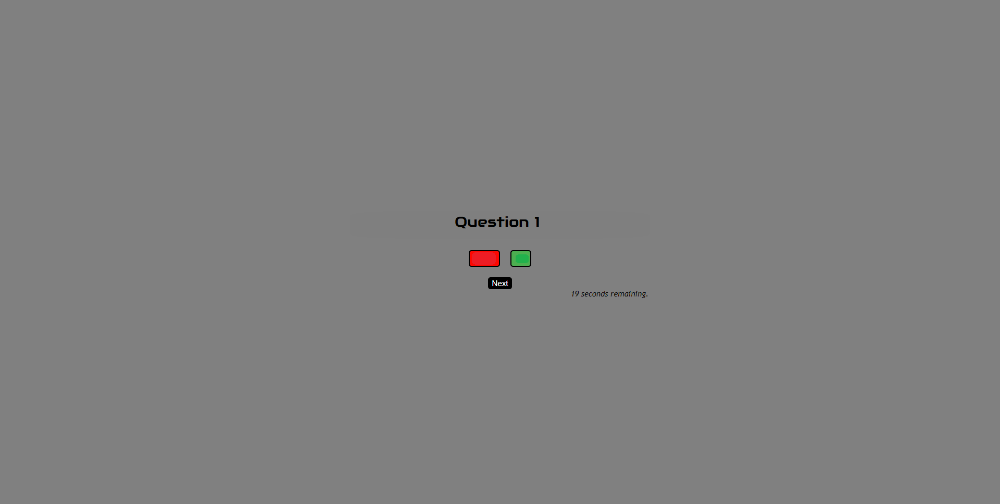
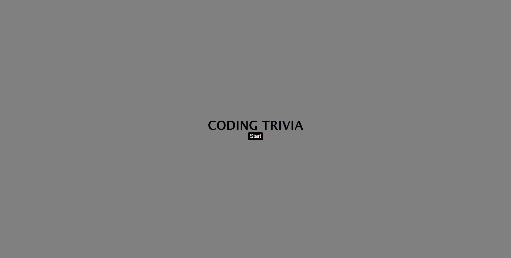

# Nux Quaestio IX

# URL: https://daniellesison.github.io/nux-quaestio-ix/

## Description

This coding trivia page allows the player to answer a series of questions that tests one's knowledge about front-end development. It includes the following functionalities:

<ul>
<li>Trivia Execution once Start has been clicked</li>
<li>Answer indicators through button color. (Green = Correct, Red = Wrong)</li>
<li>Question randomization from an Array.</li>
<li>Countdown timer that deducts time if questions are answered incorrectly.</li>
</ul>

## Installation

N/A

## Usage

Once the webpage has initialized, click the Start Button to begin the game. Navigate through the trivia by answering the questions in the page and by clicking the Next button that will appear after every response.

Cycle through the questions by beating the timer or by getting to the last question.

## Page Preview

## Credits

Credits to the following content below that served as a basis for the developer:

Simple Steps Code (Quiz Guide) - https://simplestepscode.com/javascript-quiz-tutorial/

README tutorial - https://coding-boot-camp.github.io/full-stack/github/professional-readme-guide

JavaScript Guide - https://www.w3schools.com/js/

Additional credits to my fellow coding bootcamp students, and instructors for the positive feedback and aide throughout this challenge.

## License

N/A
